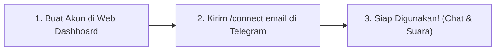
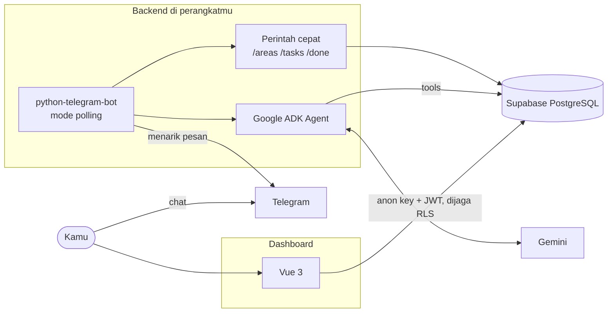

# Second Brain Agent

[](LICENSE)
[](https://python.org)
[](https://fastapi.tiangolo.com)
[](https://vuejs.org)
[](https://t.me/BotFather)
[](https://docs.google.com/forms/d/e/1FAIpQLSchtkcU2s55nVvISOAwxW_fRpRDkfip4DHsaxi5mplTXlqxmQ/viewform)

Asisten pribadi di Telegram yang membantu menjawab satu pertanyaan setiap hari: **"apa yang harus saya kerjakan sekarang?"**

Tangkap ide, catat tugas beserta deadline-nya, lacak sesi fokus, dan atur prioritas di antara beberapa area hidup — kuliah, pekerjaan, project pribadi — cukup lewat chat biasa.

> **Status:** ✅ Siap pakai & open-source. Semua fitur inti (tugas, area, timer, prioritas deterministik, brief pagi, habit, bedtime guardian, voice note, weekly report, knowledge graph, dan self-serve auth) telah terimplementasi dan teruji 100%.

---

## 🚀 Panduan Cepat Memulai (3 Langkah Mudah)

Siapa pun bisa langsung menggunakan Second Brain Agent dalam hitungan menit:



### Langkah 1: Buat Akun di Dashboard Web
1. Buka dashboard web Second Brain di browsermu (`http://localhost:5173`).
2. Pilih tab **Daftar Baru (Sign Up)**, isi Nama Lengkap, Email, dan Password (minimal 6 karakter).
3. Klik **Buat Akun Sekarang** — kamu akan langsung diarahkan masuk ke dashboard.

### Langkah 2: Tautkan Akun ke Bot Telegram
Pilih salah satu cara termudah:
- **Opsi A (Rekomendasi - Instan):** Buka bot Second Brain di Telegram, lalu kirim perintah:  
  `/connect email@kamu.com`  
  *(ganti dengan email yang kamu daftarkan di dashboard web)*.
- **Opsi B (Form Dashboard):** Kirim `/start` di bot Telegram untuk melihat Chat ID kamu, lalu salin dan masukkan Chat ID tersebut pada kartu penghubung di dashboard web, lalu klik **Hubungkan**.

### Langkah 3: Mulai Gunakan!
Akunmu sekarang aktif dan tersinkronisasi secara real-time! Kamu bisa langsung:
- Kirim pesan biasa: `tugas kerja: kirim invoice deadline jumat`
- Rekam **Voice Note**: Diktekan ide atau tugas saat sedang di jalan/mobile tanpa perlu mengetik.
- Mulai sesi fokus: `mulai ngoding backend`
- Cek prioritas: `/tasks`
- Saat jenuh: `/chill` untuk memutar YouTube Music santai atau `/kopi` untuk memesan kopi di ShopeeFood.

---

## Kenapa project ini ada

Daftar tugas biasa punya masalah yang sama: semakin panjang daftarnya, semakin bingung mulai dari mana. Second Brain Agent tidak mencoba menampilkan lebih banyak tugas — tujuannya menampilkan **lebih sedikit**, dengan urutan yang jelas dan alasan yang bisa dipahami.

Prinsip yang dipegang:

- **Tanpa hambatan.** Kirim pesan seperti ngobrol biasa. Tidak ada form ribet, tidak ada aplikasi yang harus dibuka terus-menerus.
- **Keputusan penting dihitung kode, bukan AI.** Urutan prioritas ditentukan logika deterministik yang bisa diuji. AI hanya membantu memahami bahasa sehari-hari.
- **Tetap jalan saat AI tidak tersedia.** Fitur inti tidak bergantung pada kuota API (Zero Data Loss).
- **Data milikmu sendiri.** Kamu menjalankan instance-mu sendiri dengan Row Level Security (RLS). Tidak ada server pihak ketiga yang memata-matai datamu.

---

## Fitur

| Fitur | Status |
| --- | --- |
| Tangkap ide dan catatan dari chat | ✅ |
| Timer deep work per project, rekap harian dan mingguan | ✅ |
| Area hidup yang bisa diatur dan diurutkan sendiri (bobot prioritas) | ✅ |
| Tugas dengan deadline dari bahasa sehari-hari ("deadline jumat") | ✅ |
| Penanda tugas mendesak (Urgent flag) | ✅ |
| Perintah cepat tanpa AI (`/areas`, `/tasks`, `/done`, `/habits`, `/timer`, `/night`, `/chill`, `/kopi`, `/weekly`) | ✅ |
| Dashboard web modern dengan registrasi mandiri, login email/password & magic link | ✅ |
| Penautan akun Telegram mandiri cukup via email (`/connect email@kamu.com`) | ✅ |
| Fungsi prioritas: tiga tugas teratas beserta alasannya (3-tier deterministik) | ✅ |
| Brief pagi otomatis (0 kuota LLM, susulan instan saat online) | ✅ |
| Pelacakan kebiasaan harian (streak & integrasi ke brief pagi) | ✅ |
| Pengingat istirahat saat fokus & batas jam kerja malam (*bedtime guardian*) | ✅ |
| Mode Jeda & Recharge (YouTube Music, ShopeeFood kopi, film santai, ide hangout) | ✅ |
| Transkripsi voice note multimodal via Gemini Audio (terhubung langsung ke aksi agent) | ✅ |
| Laporan mingguan pola kerja & refleksi cerdas (otomatis Minggu malam & on-demand `/weekly`) | ✅ |
| Visualisasi hubungan antar catatan (Knowledge Graph interaktif di dashboard) | ✅ |
| Tombol interaktif Telegram 1-tap (`/tasks`, `/habits`, `/timer`) | ✅ |
| Template starter produktivitas 1-klik (`/preset` Akademisi, Developer, Bisnis) | ✅ |
| Ekspor catatan & tugas ke file Markdown Obsidian/Notion (`/export`) | ✅ |
| Transparansi privasi & pemutusan tautan mandiri (`/privacy`, `/disconnect`) | ✅ |
| Desktop Ambient Watcher (pelacak otomatis aktivitas VS Code) | ✅ |
| Windows Native Toast Notification (*Bedtime Guardian Live Alert*) | ✅ |
| Global Quick Capture keyboard shortcut (`Ctrl + Shift + Space`) | ✅ |
| Git Commit Hook (otomatis menyelesaikan tugas & sinkron habit via commit) | ✅ |

---

## Cara pakai

Kirim pesan ke bot seperti biasa. Agent yang menentukan aksinya.

| Kirim | Yang terjadi |
| --- | --- |
| `ide: bikin fitur export notes ke markdown` | Disimpan sebagai catatan dengan tag otomatis |
| `area saya: Kuliah, Kerja, Project` | Membuat area, urutannya jadi bobot prioritas |
| `tambah area Kesehatan` | Menambah area di urutan terakhir |
| `ubah urutan area: Kerja, Kuliah, Project` | Mengubah urutan prioritas |
| `tugas kuliah: revisi bab 2 deadline jumat` | Menyimpan tugas di area Kuliah dengan deadline Jumat terdekat |
| `tandai mendesak #3` | Menandai tugas #3 sebagai mendesak |
| `mulai ngoding second brain` | Memulai timer deep work |
| `udahan dulu` | Menghentikan timer, durasi dicatat |
| `rekap hari ini` | Ringkasan waktu fokus dan catatan hari ini |
| `cari catatan soal vue` | Mencari catatan berdasarkan kata kunci |
| `jenuh nih, butuh rehat` | Membuka Mode Jeda dengan rekomendasi musik, kopi, film, atau hangout |
| *(Kirim Voice Note)* | Ditranskripsikan otomatis via Gemini dan langsung dieksekusi sebagai tugas/catatan/timer |

### Perintah cepat

Perintah berikut **tidak memakai AI** (atau minim dependensi) — responsnya instan dan andal:

| Perintah | Fungsi |
| --- | --- |
| `/start` | Sapaan, atau menampilkan Chat ID kalau akun belum terhubung |
| `/areas` | Daftar area terurut berdasarkan prioritas |
| `/tasks` | Daftar tugas pending terurut algoritma prioritas (3-tier) beserta ID-nya |
| `/done <id>` | Menandai tugas selesai secara instan |
| `/habits` | Melihat daftar habit aktif dan streak saat ini |
| `/check <id>` | Mencentang habit yang sudah diselesaikan hari ini |
| `/timer` | Melihat status timer aktif beserta durasi berjalan |
| `/stop` | Menghentikan timer aktif secara langsung |
| `/night [HH:MM]` | Melihat atau mengubah batas jam kerja malam (*bedtime guardian*) |
| `/chill` | Menu Mode Jeda interaktif (YouTube Music, ShopeeFood, Rekomendasi Film & Hangout) |
| `/kopi` | Akses cepat pilihan menu kopi ShopeeFood |
| `/weekly` | Melihat Laporan Mingguan Pola Kerja (waktu fokus, tugas selesai, habit, tidur, insight) |
| `/preset` | Pilih template starter produktivitas (Akademisi, Software Engineer, Bisnis) |
| `/export` | Mengunduh backup seluruh catatan dan tugas dalam format Markdown (.md) |
| `/privacy` | Penjelasan jaminan keamanan, privasi data (RLS), dan hak portabilitas |
| `/disconnect` | Memutuskan tautan akun Telegram secara mandiri |
| `/connect <email atau kode>` | Menghubungkan akun Telegram dengan email web atau kode undangan |
| `/invite <nama> <email>` | Membuat kode undangan (khusus admin) |

Setiap balasan tentang tugas selalu menyebut area, nama hari, dan tanggal deadline. Kalau AI salah menangkap maksudmu, kesalahannya langsung terlihat dan bisa dikoreksi.

Pesan yang dikirim saat backend mati **tidak hilang** — akan diproses begitu backend menyala kembali.

---

## Arsitektur



Backend memakai **long polling**: bot menarik pesan dari Telegram, bukan menerima kiriman ke URL publik. Artinya tidak perlu tunnel, domain, atau IP publik — backend bisa berjalan di laptop, PC rumah, atau mini PC, di balik router mana pun.

Mode webhook tetap tersedia untuk instance yang di-deploy ke server (lihat [Mode webhook](#mode-webhook)).

**Tech stack:** Python 3.11 · FastAPI · SQLModel + asyncpg · Supabase (PostgreSQL, Auth, RLS) · python-telegram-bot · Google ADK + Gemini · Vue 3 + Vite + Tailwind CSS v4 · uv

---

## Menjalankan instance sendiri

### Yang dibutuhkan

- [uv](https://docs.astral.sh/uv/) — mengurus Python dan semua dependensi
- Project [Supabase](https://supabase.com) (free tier cukup)
- Bot Telegram dari [@BotFather](https://t.me/BotFather)
- Gemini API key dari [Google AI Studio](https://aistudio.google.com/apikey)
- Node.js, kalau ingin menjalankan dashboard

### 1. Clone dan install

```bash
git clone https://github.com/fransalwan/second-brain-agent.git
cd second-brain-agent/apps/backend
uv sync
cp .env.example .env
```

### 2. Siapkan database

#### Opsi A: Instance Baru (1-Klik via SQL Editor)
Jalankan file [`apps/backend/migrations/init_schema.sql`](apps/backend/migrations/init_schema.sql) langsung di **Supabase → SQL Editor**. Skema lengkap tabel, relasi, indeks, dan kebijakan RLS akan dibuat secara otomatis sekaligus.

#### Opsi B: Migrasi Bertahap (Instance Berjalan)
Jalankan file di `apps/backend/migrations/` secara berurutan di **Supabase → SQL Editor**:

1. `001_timer_and_timezones.sql`
2. `002_bigint_telegram_chat_id.sql`
3. `003_chat_histories_timestamptz.sql`
4. `004_invite_codes.sql`
5. `005_rls_policies.sql`
6. `006_areas_and_tasks.sql`
7. `007_add_brief_columns_to_profiles.sql`
8. `008_habits.sql`
9. `009_timer_break_reminder.sql`
10. `010_night_cutoff.sql`
11. `011_weekly_report.sql`
12. `012_allow_user_profile_management.sql`

Semua file migrasi dan file inisialisasi aman dijalankan ulang (*idempotent*).

### 3. Isi `.env`

| Variabel | Keterangan |
| --- | --- |
| `DATABASE_URL` | Supabase → **Connect** → **Session pooler** (port 5432) |
| `TELEGRAM_BOT_TOKEN` | Token dari @BotFather |
| `GOOGLE_API_KEY` | Gemini API key dari Google AI Studio |
| `SUPABASE_URL` | Supabase → Settings → API |
| `SUPABASE_SERVICE_ROLE_KEY` | Supabase → Settings → API → `service_role` (untuk kelola akun & invite) |
| `ADMIN_CHAT_ID` | Chat ID Telegram-mu — didapat dari `/start` saat bot menyala |
| `TELEGRAM_MODE` | `polling` (default) atau `webhook` |
| `GEMINI_MODEL` | Nama model Gemini yang dipakai (misal `gemini-2.5-flash`) |
| `APP_TIMEZONE` | Zona waktumu, misalnya `Asia/Jakarta` |

> Gunakan **Session pooler**, bukan Direct connection — Direct connection hanya lewat IPv6 dan sering timeout di jaringan rumah.

> Simpan `.env` sebagai **UTF-8 tanpa BOM**. BOM membuat variabel di baris pertama tidak terbaca.

### 4. Jalankan Backend

```bash
uv run uvicorn app.main:app --port 8000
```

Satu terminal saja. Tidak perlu ngrok.

### 5. Hubungkan Akun

**Cara 1 (Registrasi Mandiri - Direkomendasikan):**
1. Buat akun di dashboard web (`http://localhost:5173`) dengan email dan password.
2. Buka bot di Telegram, lalu kirim:  
   `/connect email@kamu.com`  
   *(ganti dengan email yang kamu daftarkan)*.
3. Bot langsung tersambung ke akunmu secara instan!

**Cara 2 (Sistem Undangan Admin):**
1. Kirim `/start` ke bot untuk melihat **Chat ID**-mu.
2. Isi `ADMIN_CHAT_ID` di `.env` dengan angka itu, lalu restart backend.
3. Kirim `/invite NamaKamu email@kamu.com` — bot membalas dengan kode undangan 8-karakter.
4. Kirim `/connect <kode>` — akunmu terhubung.
5. Buat area pertamamu: `area saya: Kuliah, Kerja, Project`.

### 6. Dashboard (opsional)

```bash
cd apps/dashboard
npm install
cp .env.example .env
```

Isi `VITE_SUPABASE_URL` dan `VITE_SUPABASE_ANON_KEY` (anon key aman untuk browser — isolasi data dijaga RLS). Lalu:

```bash
npm run dev
```

Di Supabase → **Authentication → URL Configuration**, isi **Site URL** dengan `http://localhost:5173` dan tambahkan `http://localhost:5173/**` ke **Redirect URLs**, supaya tautan login magic link kembali ke dashboard.

---

## Tentang kuota Gemini

Free tier Gemini dibatasi per hari dan per menit untuk setiap model. Satu pesan chat bisa memakai dua sampai tiga request — satu untuk memilih aksi, satu lagi untuk merangkai balasan.

Kalau kuota habis:

- Pesan bahasa bebas tetap **disimpan sebagai catatan mentah**, tidak ada yang hilang
- Perintah cepat (`/areas`, `/tasks`, `/done`) tetap bekerja normal
- Kuota pulih otomatis setelah reset harian

Cek batas dan pemakaianmu di [ai.dev/rate-limit](https://ai.dev/rate-limit). Model varian *lite* biasanya punya batas lebih longgar.

---

## Mode webhook

Untuk instance di server dengan URL publik, set di `.env`:

```
TELEGRAM_MODE=webhook
TELEGRAM_WEBHOOK_SECRET=<string acak>
```

Buat secret dengan `uv run python -c "import secrets; print(secrets.token_urlsafe(32))"`, lalu daftarkan webhook ke `https://<domainmu>/telegram/webhook` dengan parameter `secret_token` yang sama.

Saat kembali ke mode polling, webhook dihapus otomatis.

---

## Troubleshooting

| Gejala | Penyebab | Solusi |
| --- | --- | --- |
| Bot tidak membalas sama sekali | Backend mati, atau menjalankan kode lama | Restart backend. Di mode polling, pesan **tidak** muncul di log uvicorn — itu normal |
| Perintah `/xxx` diabaikan | Perintah belum ada di versi yang berjalan | Restart backend setelah menarik kode baru |
| `409 Conflict` di log | Dua proses memakai token bot yang sama | Hentikan semua proses, jalankan satu saja. Muncul sesaat saat restart itu normal |
| "AI sedang bermasalah" | Kuota Gemini habis (429) atau server Gemini sibuk (503) | Tunggu; pesanmu sudah tersimpan sebagai catatan |
| `404 NOT_FOUND` dari Gemini | Model sudah dipensiunkan | Ganti `GEMINI_MODEL`; pesan error biasanya menyebut penggantinya |
| `uv trampoline failed to canonicalize script path` | Folder project dipindah bersama `.venv` | `rm -rf .venv` lalu `uv sync` |
| `password authentication failed` / timeout IPv6 | `DATABASE_URL` salah atau memakai Direct connection | Salin ulang URI Session pooler |
| Variabel `.env` tidak terbaca | File tersimpan dengan BOM, atau backend belum di-restart | Simpan ulang sebagai UTF-8 tanpa BOM; restart |
| Dashboard kosong padahal data ada | Migrasi 005/006 belum dijalankan, atau akun belum `/connect` | Jalankan migrasi; hubungkan akun |
| Magic link tidak kembali ke dashboard | Redirect URL belum didaftarkan | Tambahkan URL dashboard di Supabase → URL Configuration |

Catatan waktu: semua timestamp disimpan dalam UTC. Nilai di Supabase akan tampak berbeda beberapa jam dari waktu lokalmu — itu benar, konversi dilakukan saat ditampilkan.

---

## Keamanan

- **Isolasi data.** Backend memfilter setiap query berdasarkan pengguna yang ditentukan server dari Chat ID Telegram, tidak pernah dari output AI. Dashboard dilindungi Row Level Security dengan akses baca saja.
- **Undangan aman.** `/connect` menolak kode yang akunnya sudah terhubung, sehingga kode tidak bisa dipakai untuk memindahkan akun orang lain. `/invite` tidak merespons sama sekali untuk selain admin.
- **ID tidak bocor.** Mencoba menyelesaikan tugas milik orang lain menghasilkan pesan yang identik dengan ID yang tidak ada.
- **Jangan commit `.env`.** Periksa dengan `git check-ignore -v apps/backend/.env`.
- **Kalau secret terekspos** (di screenshot, chat, atau log), rotasi segera: revoke token di @BotFather, buat API key baru, reset password database.

---

## Pengembangan

Tes otomatis memakai SQLite di memori (Rule 13) dan tidak menyentuh database asli Supabase:

```bash
cd apps/backend
uv run python tests/test_priority.py          # Logika prioritas 3-tier
uv run python tests/test_brief_scheduler.py   # Formatter & scheduler brief pagi
uv run python tests/test_direct_commands.py   # Perintah cepat non-LLM & isolasi user
uv run python tests/test_task_tools.py        # Validasi tool tugas & injeksi tanggal
uv run python tests/test_habits.py            # Habit, streak, & idempotent check
uv run python tests/test_break_reminder.py    # Pengingat istirahat & /timer /stop
uv run python tests/test_night_cutoff.py      # Batas jam kerja malam & /night
uv run python tests/test_recharge.py          # Mode Jeda, YouTube Music & ShopeeFood
uv run python tests/test_weekly_report.py      # Laporan mingguan pola kerja & scheduler
uv run python tests/test_voice_transcriber.py # Transkripsi suara & routing ke agent
uv run python tests/test_connect_email.py     # Autentikasi email & penautan instan
```

### Menjalankan Seluruh Test Suite

```bash
cd apps/backend
uv run --with pytest --with pytest-asyncio pytest -o asyncio_mode=auto
```

### Seeding Data Awal (Uji Coba Cepat)

Jika ingin mengisi database dengan sampel data lengkap (4 Area Hidup, 11 Tugas prioritas 3-tier, Habit dengan streaks, Sesi fokus, dan Catatan Knowledge Graph):

```bash
cd apps/backend
# Sesuaikan TARGET_EMAIL di seed_user_data.py dengan email akunmu
uv run python seed_user_data.py
```

Project ini dikembangkan dengan bantuan AI coding agent. Folder `.agents/rules/` berisi aturan yang dibaca otomatis oleh agent — setiap aturan berasal dari bug yang pernah terjadi, bukan preferensi gaya. Membacanya adalah cara tercepat memahami keputusan desain di project ini.

Menambah dependensi: `uv add <paket>`. Perubahan skema: file SQL bernomor baru di `migrations/`, lengkap dengan kebijakan RLS.

---

## 💬 Beri Masukan & Evaluasi Pengguna

Apakah kamu sudah mencoba Second Brain Agent? Kami sangat mengharapkan masukan, kritik, dan ide pengembangan dari kamu:

👉 **[Isi Form Evaluasi & Wishlist Fitur (Google Form)](https://docs.google.com/forms/d/e/1FAIpQLSchtkcU2s55nVvISOAwxW_fRpRDkfip4DHsaxi5mplTXlqxmQ/viewform)**

Setiap masukan akan dipelajari dan menjadi bahan pertimbangan utama untuk roadmap pengembangan berikutnya!

---

## Roadmap

**Selesai**

- [x] Fungsi prioritas — tiga tugas teratas beserta alasannya (3-tier deterministik)
- [x] Brief pagi otomatis, dengan susulan kalau perangkat baru dinyalakan setelah jadwal
- [x] Pelacakan kebiasaan harian (streak, idempotent check, ringkasan brief)
- [x] Pengingat istirahat saat sesi fokus terlalu lama (>= 90 menit, anti-spam)
- [x] Batas jam kerja malam (*bedtime guardian*, /night, dan soft warning)
- [x] Mode Jeda & Recharge (YouTube Music & ShopeeFood kopi)
- [x] Transkripsi voice note multimodal via Gemini Audio
- [x] Laporan mingguan pola kerja & keseimbangan istirahat (`/weekly` & penjadwalan otomatis)
- [x] Visualisasi hubungan antar catatan (Interactive Knowledge Graph di dashboard)
- [x] File skema gabungan untuk instalasi 1-klik (`init_schema.sql`)
- [x] Sistem registrasi & autentikasi mandiri kredensial (Email & Password di dashboard)
- [x] Penautan instan akun Telegram via email (`/connect email@kamu.com`)
- [x] Tombol interaktif Telegram (1-tap inline keyboards untuk /tasks, /habits, /timer)
- [x] 1-Click Starter Presets (`/preset` untuk Mahasiswa, Developer, Bisnis)
- [x] Export Catatan ke format Markdown / Obsidian (`/export`)
- [x] Jaminan privasi transparan & pemutusan tautan mandiri (`/privacy`, `/disconnect`)
- [x] Desktop Ambient Watcher & Windows Native Toast Bedtime Guardian
- [x] Global Quick Capture (`Ctrl + Shift + Space`) & Git Commit Hook
- [x] Rilis Produksi v1.0.0 (Stabil & Siap Pakai)

**Mendatang (Berdasarkan Feedback Komunitas)**

- [ ] Integrasi Kalender (Google Calendar sync)
- [ ] Ekspor Laporan Mingguan ke format PDF
- [ ] Dukungan PWA / Offline cache untuk mobile browser

---

## Lisensi

MIT — lihat [LICENSE](LICENSE).