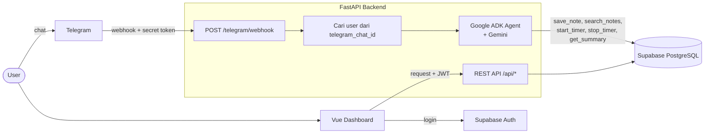

# Second Brain & Time Management Agent

Sistem multi-user berbasis AI untuk menangkap ide tanpa hambatan (*frictionless capture*) dan melacak waktu *deep work*, langsung dari Telegram.

Dibuat sebagai utilitas pribadi dan untuk lingkaran terbatas. Tanpa gamifikasi, tanpa fitur sosial. Fokusnya efisiensi, kejernihan pikiran, dan pelacakan progres kerja.

> **Status:** 🚧 Fase 2 selesai — seluruh agent tool sudah terverifikasi end-to-end lewat Telegram di lingkungan lokal. Berikutnya: `/connect` otomatis, lalu deployment. Belum siap dipakai publik.

## Tujuan

1. **Zero-friction capture** — rekam ide, tugas, atau catatan mentah kapan saja lewat Telegram.
2. **Deep work tracking** — lacak durasi sesi fokus (coding, menulis, belajar) tanpa distraksi.
3. **AI-driven synthesis** — AI agent memahami maksud pesan, merapikan catatan, dan membuat ringkasan.
4. **Privasi & isolasi data** — data setiap pengguna terisolasi (lihat [Catatan Keamanan](#catatan-keamanan)).
5. **Keberlanjutan** — mekanisme donasi sederhana untuk menutup biaya server.

## Cara Pakai (Telegram)

Cukup kirim pesan dengan bahasa sehari-hari. Agent yang menentukan aksinya.

| Contoh pesan | Yang terjadi |
| --- | --- |
| `ide: bikin fitur export notes ke markdown` | Disimpan sebagai catatan + tag otomatis |
| `mulai ngoding second brain` | Timer deep work dimulai |
| `udahan dulu` | Timer dihentikan, durasi dicatat |
| `rekap hari ini` / `rekap minggu ini` | Ringkasan waktu fokus per proyek + catatan terbaru |
| `cari catatan soal vue` | Mencari catatan berdasarkan kata kunci |

Kalau AI sedang gagal (misalnya limit API), pesan tetap disimpan sebagai catatan mentah sehingga tidak ada ide yang hilang.

> Batas "hari ini" mengikuti tengah malam waktu `APP_TIMEZONE`. Sesi yang dimulai pukul 23:35 dan rekap yang diminta pukul 00:10 dihitung sebagai dua hari berbeda.

## Tech Stack

| Lapisan | Teknologi |
| --- | --- |
| Backend & API | Python 3.11+, FastAPI, SQLModel, SQLAlchemy (async) + asyncpg |
| Database & Auth | Supabase (PostgreSQL, Auth, Row Level Security) |
| AI Agent | Google ADK (Agent Development Kit) + Gemini (`gemini-3.6-flash`) |
| Bot | Telegram Bot API via webhook (`python-telegram-bot`) |
| Dashboard | Vue 3 (Composition API), Vite, Tailwind CSS v4, `shadcn-vue` |
| Infrastruktur | ngrok (dev lokal), Railway/Render (backend), Vercel/Netlify (dashboard) |
| Tooling development | Antigravity IDE (agent-first, membaca `.agents/`) |

## Arsitektur



**Alur pesan Telegram:**

1. Telegram mengirim update ke `POST /telegram/webhook`. Request tanpa secret token yang benar ditolak (403).
2. Endpoint memasukkan update ke `update_queue` milik `python-telegram-bot` lalu langsung membalas `200 OK`, supaya Telegram tidak melakukan retry saat agent butuh waktu lama.
3. Backend mencari profil berdasarkan `telegram_chat_id`. Chat yang belum terhubung tidak diproses.
4. Pesan diteruskan ke ADK agent bersama `user_id` milik pengirim. `user_id` ini ditentukan server, bukan oleh LLM.
5. Agent memanggil tool yang sesuai, balasannya dikirim ke Telegram, dan percakapan dicatat di `chat_histories`.

Seluruh timestamp disimpan dalam UTC (`timestamptz`) dan dikonversi ke `APP_TIMEZONE` hanya di lapisan tampilan. Artinya nilai di Supabase akan terlihat mundur 7 jam dari WIB — itu perilaku yang benar, bukan bug.

Dashboard (Fase 3) belum dibuat.

## Struktur Proyek

```text
second-brain-agent/
├── .agents/
│   ├── rules/               # Aturan project untuk AI coding agent
│   └── skills/              # Panduan Google ADK
├── apps/
│   └── backend/
│       ├── app/
│       │   ├── main.py      # FastAPI app, lifespan bot, endpoint webhook
│       │   ├── bot.py       # Handler Telegram (/start, pesan teks, fallback)
│       │   ├── agent.py     # ADK agent, tools, dan runner
│       │   ├── config.py    # Settings dari .env (pydantic-settings)
│       │   ├── database.py  # Async engine & session
│       │   └── models.py    # Tabel: profiles, notes, chat_histories, time_logs, donations
│       ├── migrations/      # SQL yang dijalankan manual di Supabase
│       ├── requirements.txt
│       └── .env.example
├── .gitignore
└── README.md
```

## Development dengan AI Agent

Project ini dikembangkan dengan bantuan [Antigravity](https://antigravity.google), IDE agent-first dari Google. Folder `.agents/` berisi konteks yang dibaca otomatis oleh AI coding agent:

| Folder | Isi | Fungsi |
| --- | --- | --- |
| `.agents/skills/` | Dokumentasi Google ADK | Pengetahuan domain: cara membuat agent, tools, dan runner yang benar |
| `.agents/rules/` | Aturan project | Standar yang wajib diikuti saat menulis kode di repo ini |

Aturan di `.agents/rules/` **tidak berisi preferensi gaya**, melainkan invariant yang berasal dari bug yang sudah pernah terjadi:

1. Field datetime wajib `sa_type=DateTime(timezone=True)`
2. Secret hanya diakses lewat `app/config.py`, tidak pernah hardcode
3. `user_id` ditentukan server dari `telegram_chat_id`, bukan dari output LLM
4. Webhook membalas 200 sebelum memproses agent
5. Migrasi database manual dan idempotent

Setelah membuka project di Antigravity, verifikasi rules terbaca dengan bertanya di panel agent (`Ctrl+L`):

> Apa aturan project ini soal field datetime di SQLModel, dan kenapa aturan itu ada?

Jawaban yang benar menyebut `sa_type=DateTime(timezone=True)` beserta alasannya (penolakan asyncpg, insert gagal). Jawaban generik tentang timezone berarti rules belum aktif.

Manfaat konkret di project ini: audit statis seluruh field datetime dan perhitungan durasi selesai dalam hitungan detik, menggantikan trial-and-error lewat Telegram yang butuh berkali-kali percobaan.

## Roadmap MVP (v1.0)

### Fase 1 — Fondasi & Isolasi Data
- [x] Struktur monorepo (`apps/backend`)
- [x] Project Supabase (Database & Auth)
- [x] Koneksi FastAPI ↔ Supabase (SQLModel + asyncpg, session pooler)
- [x] Tabel `profiles`, `notes`, `chat_histories`, `time_logs`
- [x] Timestamp timezone-aware (`timestamptz`) di seluruh model
- [ ] Kebijakan RLS untuk akses via Supabase API (dashboard)

### Fase 2 — Telegram Bridge & AI Agent ✅
- [x] Bot Telegram via webhook FastAPI (dengan `secret_token`)
- [x] Tunnel untuk dev lokal (ngrok)
- [x] Integrasi Google ADK + Gemini
- [x] Agent tools: `save_note`, `search_notes`, `start_timer`, `stop_timer`, `get_summary`
- [x] Fallback: simpan pesan mentah saat agent gagal
- [x] Riwayat percakapan persisten di tabel `chat_histories`
- [x] Uji end-to-end seluruh tool di Telegram
- [x] Setup `.agents/` untuk AI-assisted development

### Fase 2.5 — Onboarding
- [ ] Perintah `/connect` otomatis, menggantikan pendaftaran manual lewat SQL

### Fase 3 — Dashboard & Visualisasi
- [ ] Setup Vue 3 + Vite + Tailwind v4 + `shadcn-vue`
- [ ] Login dengan Supabase Auth
- [ ] Halaman *time logs* (grafik) dan *notes* (list & search)

### Fase 4 — Donasi & Deployment
- [ ] Halaman donasi (QRIS statis / Saweria / Trakteer)
- [ ] Deploy backend (Railway/Render) dan dashboard (Vercel/Netlify)
- [ ] Set webhook Telegram ke URL production

## Rencana Setelah v1.0

- **Knowledge graph** — visualisasi hubungan antar catatan.
- **Transkripsi voice note** — agent mentranskrip dan merangkum voice note dari Telegram.
- **Laporan mingguan** — ringkasan otomatis pola *deep work* dan produktivitas.
- **Logical day start** — opsi `DAY_START_HOUR` supaya sesi dini hari dihitung sebagai hari sebelumnya.
- **Integrasi payment gateway** (mis. Midtrans) jika donasi butuh pencatatan otomatis.

## Menjalankan Secara Lokal

### Prasyarat

- Python 3.11+
- Project [Supabase](https://supabase.com)
- Token bot Telegram dari [@BotFather](https://t.me/BotFather)
- Gemini API key dari [Google AI Studio](https://aistudio.google.com/apikey)
- [ngrok](https://ngrok.com/download) — Windows: `winget install ngrok.ngrok`
- Opsional: [Antigravity](https://antigravity.google) untuk development dengan AI agent

### 1. Clone & install

```bash
git clone https://github.com/fransalwan/second-brain-agent.git
cd second-brain-agent/apps/backend
uv sync
cp .env.example .env
```

### 2. Environment variables

| Variabel | Keterangan |
| --- | --- |
| `DATABASE_URL` | Supabase → **Connect** → **Session pooler**. Format `postgresql://postgres.<project-ref>:<password>@<host>.pooler.supabase.com:5432/postgres` |
| `TELEGRAM_BOT_TOKEN` | Token dari @BotFather. Formatnya `<bot_id>:<35 karakter>` — selalu mengandung titik dua |
| `TELEGRAM_WEBHOOK_SECRET` | String acak buatan sendiri: `python -c "import secrets; print(secrets.token_urlsafe(32))"` |
| `GOOGLE_API_KEY` | Gemini API key dari Google AI Studio |
| `GOOGLE_GENAI_USE_VERTEXAI` | `FALSE` |
| `GEMINI_MODEL` | Default `gemini-3.6-flash` |
| `APP_TIMEZONE` | Default `Asia/Jakarta` (untuk "hari ini" / "minggu ini") |

> Gunakan **Session pooler**, bukan Direct connection. Direct connection hanya lewat IPv6 dan akan timeout di kebanyakan jaringan rumah. Buat password database yang hanya berisi huruf dan angka supaya tidak merusak URL.

> **Simpan `.env` dengan encoding UTF-8 tanpa BOM dan line ending LF.** BOM (tiga byte tak terlihat di awal file, sering ditanam Notepad atau VS Code dengan opsi *UTF-8 with BOM*) membuat key di baris pertama tidak terbaca oleh `python-dotenv`. Di VS Code, klik indikator encoding dan `CRLF` di status bar kanan bawah untuk menggantinya.

Verifikasi semua nilai terbaca sebelum menjalankan apa pun:

```bash
python -c "
from app.config import settings
for k in ('TELEGRAM_BOT_TOKEN','TELEGRAM_WEBHOOK_SECRET','GOOGLE_API_KEY','GEMINI_MODEL'):
    v = getattr(settings, k, '') or ''
    print(k, 'OK' if v else 'KOSONG', len(v))
"
```

Kalau ada yang `KOSONG`, cek apakah key-nya masih ter-comment (`#`) atau salah nama:

```bash
cut -d= -f1 .env
```

### 3. Migrasi database

Jalankan file di `apps/backend/migrations/` secara berurutan di **Supabase → SQL Editor**:

1. `001_timer_and_timezones.sql`
2. `002_bigint_telegram_chat_id.sql`
3. `003_chat_histories_timestamptz.sql`

Semua migrasi aman dijalankan ulang.

### 4. Jalankan (butuh 3 terminal)

**Terminal 1 — server**
```bash
uv run uvicorn app.main:app --reload --port 8000
```
Cek koneksi database: `curl -s http://localhost:8000/test-db` harus mengembalikan `"status":"success"`.

**Terminal 2 — tunnel** (biarkan tetap terbuka; URL berganti setiap kali restart)
```bash
ngrok http 8000
```

**Terminal 3 — daftarkan webhook**
```bash
TOKEN=$(python -c "from app.config import settings; print(settings.TELEGRAM_BOT_TOKEN)" | tr -d '\r\n')
SECRET=$(python -c "from app.config import settings; print(settings.TELEGRAM_WEBHOOK_SECRET)" | tr -d '\r\n')
NGROK=$(curl -s http://127.0.0.1:4040/api/tunnels \
  | python -c "import sys,json; print([t['public_url'] for t in json.load(sys.stdin)['tunnels'] if t['public_url'].startswith('https')][0])")

curl -s -X POST "https://api.telegram.org/bot$TOKEN/setWebhook" \
  -d "url=$NGROK/telegram/webhook" \
  -d "secret_token=$SECRET" \
  -d "drop_pending_updates=true"
```

> Ambil URL dari baris **`Forwarding`** di terminal ngrok atau dari API di `127.0.0.1:4040` — **bukan** dari halaman dashboard ngrok. Mendaftarkan `app.ngrok.ai` membuat Telegram mengirim update ke server ngrok, bukan ke mesin kamu; gejalanya bot diam total tanpa satu pun log di uvicorn.

> Membaca nilai lewat `app.config` (bukan `source .env`) memastikan shell dan server memakai sumber yang sama persis, sekaligus kebal terhadap BOM dan CRLF.

Verifikasi:

```bash
curl -s "https://api.telegram.org/bot$TOKEN/getWebhookInfo" | python -m json.tool
```

Yang diharapkan: `url` menunjuk ke domain ngrok yang aktif, `pending_update_count: 0`, dan tidak ada `last_error_message` sama sekali.

### 5. Hubungkan akun Telegram

1. Kirim `/start` ke bot, catat **Chat ID** yang dibalas.
2. Buat user di **Supabase → Authentication → Users → Add user** (centang *Auto Confirm User*).
3. Jalankan di SQL Editor:

```sql
insert into public.profiles (id, full_name, telegram_chat_id, created_at)
select id, 'Nama Kamu', 123456789, now()
from auth.users
where email = 'email@contoh.com'
on conflict (id) do update set telegram_chat_id = excluded.telegram_chat_id;
```

Kirim `/start` lagi. Bot akan membalas "Akun kamu sudah terhubung".

## Troubleshooting

Cek status webhook: `curl -s "https://api.telegram.org/bot$TOKEN/getWebhookInfo" | python -m json.tool`

### Aturan pertama: restart uvicorn

Sebelum menduga ada bug di kode, pastikan server yang berjalan memuat versi terbaru. `--reload` hanya memantau file `.py` — perubahan `.env` tidak terbaca, dan proses lama bisa tertinggal memegang port.

Tiga bug yang tampak berbeda di project ini (`403 Invalid secret token`, konfigurasi yang seolah tidak berpengaruh, dan `get_summary` yang mengembalikan nol) semuanya berakar pada hal yang sama. Restart bersih lebih murah daripada debugging spekulatif.

### Bot diam total, tidak ada log apa pun di uvicorn

Request tidak sampai ke server lokal. Alat pemisah paling tajam adalah **ngrok inspector** di `http://127.0.0.1:4040`, dashboard lokal yang mencatat semua request yang masuk ke tunnel.

- **Inspector kosong** saat pesan dikirim → Telegram tidak pernah memanggil URL tunnel. Masalahnya di konfigurasi webhook: cek `url` di `getWebhookInfo`, pastikan itu domain `.ngrok-free.app` yang aktif, bukan tunnel lama.
- **Inspector berisi request** → traffic sampai. Lihat status code-nya lalu lanjut ke tabel di bawah.

### Tabel gejala

| Gejala | Penyebab | Solusi |
| --- | --- | --- |
| `last_error_message: 404` + `ip_address` asing | Webhook menunjuk ke `app.ngrok.ai` (halaman dashboard ngrok), bukan ke tunnel | `setWebhook` ulang dengan URL dari baris `Forwarding` |
| `last_error_message: 530` / `Connection refused` | Tunnel mati atau URL berganti | Jalankan ulang tunnel, lalu `setWebhook` dengan URL baru |
| `403 Invalid secret token` | Nilai secret yang dipegang uvicorn ≠ yang didaftarkan ke Telegram | Restart uvicorn — `.env` **tidak** dibaca ulang oleh `--reload` |
| `403` tetap muncul walau sudah restart | Ada proses uvicorn zombie memegang port 8000 | Lihat bagian *Port 8000* di bawah |
| `{"ok":false,"error_code":404}` dari `getMe` | `$TOKEN` kosong, atau placeholder terketik apa adanya | `echo "${#TOKEN}"` — harus 45–46 |
| `Read timeout expired` | Handler menunggu operasi lama sebelum membalas | Pastikan endpoint membalas 200 sebelum memproses agent |
| Bot membalas "AI sedang bermasalah" | Model salah/pensiun, API key salah, atau kena limit (`429`) | Lihat bagian *Gemini 404* di bawah |
| `can't subtract offset-naive and offset-aware datetimes` | Kolom datetime tidak timezone-aware | Lihat bagian *Timezone* di bawah |
| Rekap mengembalikan 0 padahal data ada | Server belum di-restart, atau batas hari sudah lewat tengah malam | Restart uvicorn; cek `mulai_wib` di `time_logs` |
| `password authentication failed` | Kredensial `DATABASE_URL` salah, atau terminal memegang nilai lama | Salin ulang URI Session pooler; buka terminal baru |
| `[Errno 10060] ... 2406:...` | Memakai Direct connection (IPv6) | Ganti ke Session pooler |
| `value out of int32 range` | Kolom `telegram_chat_id` masih `integer` | Jalankan migrasi `002` |

### Port 8000 masih dipakai setelah Ctrl+C

Proses uvicorn bisa tertinggal dan tetap memegang port. Yang menjawab request adalah instance lama dengan `.env` versi sebelumnya, sehingga perubahan konfigurasi seolah-olah tidak berpengaruh.

```bash
netstat -ano | findstr LISTENING | findstr :8000
taskkill //PID <pid> //F     # ganti <pid> dengan angka di kolom terakhir
```

Normalnya hanya ada satu atau dua baris (parent + child dari `--reload`). Lebih dari itu, matikan semuanya lalu start ulang.

### Gemini `404 NOT_FOUND`

Model sudah dipensiunkan. Lihat model yang tersedia untuk API key kamu:

```bash
GKEY=$(python -c "from app.config import settings; print(settings.GOOGLE_API_KEY)" | tr -d '\r\n')
curl -s "https://generativelanguage.googleapis.com/v1beta/models?key=$GKEY" \
  | python -c "import sys,json; [print(m['name']) for m in json.load(sys.stdin)['models'] if 'generateContent' in m.get('supportedGenerationMethods',[])]"
```

Daftar ini **tidak sepenuhnya akurat** — sebuah model bisa terdaftar tapi tetap ditolak untuk akun baru (`no longer available to new users`). Pesan error dari Google biasanya sudah menyebutkan model penggantinya; ikuti saja. Alternatifnya pakai alias `gemini-flash-latest` yang selalu menunjuk rilis flash stabil terbaru.

Tes model sebelum mengubah `.env`:

```bash
curl -s -X POST "https://generativelanguage.googleapis.com/v1beta/models/gemini-3.6-flash:generateContent?key=$GKEY" \
  -H "Content-Type: application/json" \
  -d '{"contents":[{"parts":[{"text":"halo"}]}]}' | head -c 300
```

### Timezone: `can't subtract offset-naive and offset-aware datetimes`

Terjadi saat field datetime di SQLModel tidak diberi `sa_type`, sehingga di-cast sebagai `TIMESTAMP WITHOUT TIME ZONE` padahal nilainya membawa `tzinfo=utc`. Asyncpg menolaknya dengan `DataError` dan seluruh insert ke tabel itu gagal. Kegagalan ini mudah terlewat karena sering tertangkap error handling di lapisan atas — gejalanya tabel terlihat kosong sementara alur lain tetap berjalan normal.

```python
# Salah
created_at: datetime = Field(default_factory=lambda: datetime.now(timezone.utc))

# Benar
created_at: datetime = Field(default_factory=utcnow, sa_type=DateTime(timezone=True))
```

Berlaku juga untuk field nullable seperti `TimeLog.ended_at`.

Jangan mengakalinya dengan `.replace(tzinfo=None)` — timestamp kehilangan informasi zona dan perhitungan "hari ini" / "minggu ini" berdasarkan `APP_TIMEZONE` menjadi salah.

Pastikan juga kolom di Postgres bertipe `timestamptz`:

```sql
ALTER TABLE chat_histories
ALTER COLUMN created_at TYPE timestamptz USING created_at AT TIME ZONE 'UTC';
```

### Memeriksa data dalam waktu lokal

Kolom `timestamptz` disimpan dalam UTC. Untuk melihatnya dalam WIB tanpa mengubah data:

```sql
select project_name,
       duration_minutes,
       started_at at time zone 'Asia/Jakarta' as mulai_wib,
       ended_at   at time zone 'Asia/Jakarta' as selesai_wib
from time_logs
order by started_at desc;
```

Berguna saat rekap terasa tidak sesuai — sering kali penyebabnya batas tengah malam, bukan bug.

## Catatan Keamanan

- **RLS tidak berlaku untuk query dari backend.** Backend terhubung dengan role `postgres`, yang mem-bypass RLS. Karena itu setiap query dan tool agent memfilter berdasarkan `user_id` yang ditentukan server (dari mapping `telegram_chat_id`), bukan dari input LLM.
- **Webhook divalidasi** dengan header `X-Telegram-Bot-Api-Secret-Token` menggunakan `secrets.compare_digest` (perbandingan constant-time).
- Bot hanya memproses **chat pribadi**; pesan grup dan pesan yang di-edit diabaikan.
- Jangan pernah commit `.env`, dan jangan menaruh `service_role` key atau `DATABASE_URL` di kode frontend. Verifikasi dengan `git check-ignore -v .env` dan `git log --all --oneline -- "*.env"`.
- Saat menempelkan output terminal ke mana pun (issue, chat, screenshot), **sensor token**. Untuk membandingkan dua nilai tanpa mengeksposnya, bandingkan hash-nya:
  ```bash
  python -c "import hashlib,sys; s=sys.argv[1]; print(len(s), hashlib.sha256(s.encode()).hexdigest()[:12])" "$SECRET"
  ```
- Jika sebuah secret sempat terekspos (log, screenshot, chat), segera rotasi: reset password database, buat API key baru, atau revoke token di @BotFather → `/mybots` → **API Token** → **Revoke current token**.

## Dukung Pengembangan

Jika alat ini bermanfaat dan kamu ingin membantu biaya server, silakan kunjungi halaman donasi di dashboard (setelah Fase 4) atau hubungi maintainer.

## Lisensi

Belum ditentukan.
