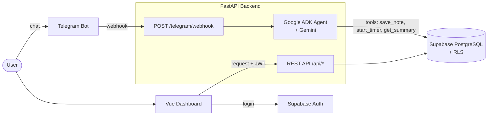

# Second Brain & Time Management Agent

Sistem multi-user berbasis AI untuk menangkap ide tanpa hambatan (*frictionless capture*) dan melacak waktu *deep work*.

Dibuat sebagai utilitas pribadi dan untuk lingkaran terbatas. Tanpa gamifikasi, tanpa fitur sosial. Fokusnya efisiensi, kejernihan pikiran, dan pelacakan progres kerja.

> **Status:** 🚧 Tahap awal pengembangan (Fase 1). Belum siap dipakai.

## Tujuan

1. **Zero-friction capture** — rekam ide, tugas, atau catatan mentah kapan saja lewat Telegram.
2. **Deep work tracking** — lacak durasi sesi fokus (coding, menulis, belajar) tanpa distraksi.
3. **AI-driven synthesis** — AI agent merapikan, mengkategorikan, dan merangkum catatan mentah menjadi insight yang bisa ditindaklanjuti.
4. **Privasi & isolasi data** — data setiap pengguna terisolasi (lihat [Catatan Keamanan](#catatan-keamanan)).
5. **Keberlanjutan** — mekanisme donasi sederhana untuk menutup biaya server.

## Tech Stack

| Lapisan | Teknologi |
| --- | --- |
| Backend & API | Python 3.11+, FastAPI, SQLModel |
| Database & Auth | Supabase (PostgreSQL, Auth, Row Level Security) |
| AI Agent | Google ADK (Agent Development Kit) + Gemini |
| Bot | Telegram Bot API (`python-telegram-bot`) |
| Dashboard | Vue 3 (Composition API), Vite, Tailwind CSS v4, `shadcn-vue` |
| Infrastruktur | Cloudflare Tunnel (dev lokal), Railway/Render (backend), Vercel/Netlify (dashboard) |

## Arsitektur



**Alur singkat:**

- **Telegram → Agent:** pesan masuk lewat webhook, backend mencari `user_id` dari `telegram_chat_id`, lalu agent memproses pesan dan memanggil *tools* untuk membaca/menulis data.
- **Dashboard → API:** pengguna login via Supabase Auth, dashboard memanggil FastAPI dengan JWT, backend memverifikasi JWT dan hanya mengembalikan data milik pengguna tersebut.

## Struktur Proyek

```text
second-brain-agent/
├── apps/
│   ├── backend/          # FastAPI + Telegram webhook + ADK agent
│   │   ├── app/
│   │   ├── requirements.txt
│   │   └── .env.example
│   └── dashboard/        # Vue 3 (belum dibuat, Fase 3)
├── .gitignore
└── README.md
```

## Roadmap MVP (v1.0)

### Fase 1 — Fondasi & Isolasi Data
- [x] Struktur awal monorepo (`apps/backend`)
- [ ] Setup project Supabase (Database & Auth)
- [ ] Koneksi FastAPI ↔ Supabase via SQLModel
- [ ] Tabel `profiles`, `notes`, `time_logs`
- [ ] Kebijakan RLS + filter `user_id` di semua query backend

### Fase 2 — Telegram Bridge & AI Agent
- [ ] Bot Telegram + endpoint webhook di FastAPI (dengan `secret_token`)
- [ ] Cloudflare Tunnel untuk menerima webhook saat dev lokal
- [ ] Fitur "Connect Account" (mapping `telegram_chat_id` → `user_id`)
- [ ] Integrasi Google ADK
- [ ] Agent tools dasar: `save_note`, `start_timer`, `stop_timer`, `get_summary`

### Fase 3 — Dashboard & Visualisasi
- [ ] Setup Vue 3 + Vite + Tailwind v4 + `shadcn-vue`
- [ ] Login dengan Supabase Auth
- [ ] Halaman *time logs* (grafik) dan *notes* (list & search)

### Fase 4 — Donasi & Deployment
- [ ] Halaman donasi (QRIS statis / Saweria / Trakteer)
- [ ] Deploy backend (Railway/Render) dan dashboard (Vercel/Netlify)
- [ ] Set webhook Telegram ke URL production

## Rencana Setelah v1.0

- **Knowledge graph** — visualisasi hubungan antar catatan.
- **Transkripsi voice note** — agent mentranskrip dan merangkum voice note dari Telegram.
- **Laporan mingguan** — ringkasan otomatis pola *deep work* dan produktivitas.
- **Integrasi payment gateway** (mis. Midtrans) jika donasi butuh pencatatan otomatis.

## Menjalankan Secara Lokal

### Prasyarat

- Python 3.11+
- Node.js 22 LTS atau lebih baru (untuk dashboard)
- Project [Supabase](https://supabase.com)
- Token bot Telegram dari [@BotFather](https://t.me/BotFather)
- Gemini API key dari [Google AI Studio](https://aistudio.google.com/apikey)
- [`cloudflared`](https://developers.cloudflare.com/cloudflare-one/connections/connect-networks/) (untuk tes webhook Telegram)

### 1. Clone repo

```bash
git clone https://github.com/fransalwan/second-brain-agent.git
cd second-brain-agent
```

### 2. Backend

```bash
cd apps/backend
python -m venv .venv
source .venv/bin/activate        # Windows: .venv\Scripts\activate
pip install -r requirements.txt
cp .env.example .env             # lalu isi nilainya
uvicorn app.main:app --reload --port 8000
```

API docs tersedia di http://localhost:8000/docs.

### 3. Environment variables

| Variabel | Keterangan |
| --- | --- |
| `DATABASE_URL` | Connection string Supabase, format `postgresql+psycopg://...` |
| `SUPABASE_URL` | URL project Supabase (dipakai untuk verifikasi JWT) |
| `TELEGRAM_BOT_TOKEN` | Token dari @BotFather |
| `TELEGRAM_WEBHOOK_SECRET` | String acak untuk memvalidasi request webhook |
| `GOOGLE_API_KEY` | Gemini API key |
| `GOOGLE_GENAI_USE_VERTEXAI` | Isi `FALSE` jika memakai API key dari AI Studio |

> Gunakan **Session pooler** (port `5432`) dari halaman *Connect* di Supabase. Direct connection hanya mendukung IPv6, dan Transaction pooler (port `6543`) tidak mendukung prepared statements.

### 4. Webhook Telegram (dev lokal)

```bash
cloudflared tunnel --url http://localhost:8000
```

Lalu daftarkan URL tunnel sebagai webhook:

```bash
curl "https://api.telegram.org/bot<TELEGRAM_BOT_TOKEN>/setWebhook" \
  -d "url=https://<subdomain>.trycloudflare.com/telegram/webhook" \
  -d "secret_token=<TELEGRAM_WEBHOOK_SECRET>"
```

### 5. Dashboard

Belum tersedia (Fase 3).

## Catatan Keamanan

- **RLS tidak berlaku untuk query dari backend.** Backend terhubung lewat `DATABASE_URL` dengan role `postgres`, yang mem-bypass RLS. RLS hanya melindungi akses lewat Supabase API (misalnya `supabase-js` dengan publishable/anon key). Karena itu, **setiap query di backend wajib memfilter berdasarkan `user_id`** yang berasal dari JWT terverifikasi (dashboard) atau dari mapping `telegram_chat_id` (bot).
- **Validasi webhook Telegram.** Tolak request yang header `X-Telegram-Bot-Api-Secret-Token`-nya tidak cocok dengan `TELEGRAM_WEBHOOK_SECRET`.
- **Jangan pernah** menaruh `service_role` key atau `DATABASE_URL` di kode dashboard.
- Pastikan `.env` tercantum di `.gitignore`.

## Dukung Pengembangan

Jika alat ini bermanfaat dan kamu ingin membantu biaya server, silakan kunjungi halaman donasi di dashboard (setelah Fase 4) atau hubungi maintainer.

## Lisensi

Belum ditentukan.
