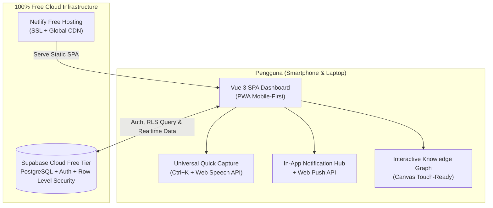

# Second Brain (Student Edition 🎓)

[](LICENSE)
[-blue.svg)](apps/dashboard/package.json)
[-success.svg)](apps/dashboard/test-features.cjs)
[](https://vuejs.org)
[](https://vitejs.dev)
[](https://supabase.com)
[](apps/dashboard)
[](apps/dashboard)
[](apps/dashboard)
[](apps/dashboard)
[](apps/dashboard)
[](apps/dashboard)
[](apps/dashboard)
[](apps/dashboard)
[](netlify.toml)

> **"Lulus Skripsi & Kuliah Sukses, Tetap Sehat, dan Me-Time Tanpa Rasa Bersalah."**

**Second Brain (Student Edition)** adalah platform manajemen hidup dan produktivitas mandiri (*Autonomous Life & Study Balance Hub*) berbasis web **Mobile-First** yang dirancang khusus untuk memecahkan beban mental mahasiswa: tugas menumpuk, skripsi macet, pola tidur rusak, dan *burnout*. 

Kini hadir sepenuhnya **End-to-End Standalone di Web Dashboard**, lengkap dengan **Simulator Target Nilai & IPK Semester**, **Tab Panduan Penggunaan Interaktif**, **Universal Quick Capture Bar (`Ctrl + K` / Suara)**, **Pusat Notifikasi Cerdas (In-App Notification Center)**, dan **Browser Web Push Notification** tanpa memerlukan bot pihak ketiga.

🌐 **Akses Aplikasi (Gratis):**  
👉 **[https://second-brain-agent.netlify.app/](https://second-brain-agent.netlify.app/)**

---

## 🧭 4 Pilar Kehidupan Mahasiswa

Second Brain mengatur ritme hidup mahasiswa dengan prinsip prioritas deterministik teruji:

| No | Pilar | Prioritas | Fitur Unggulan Mahasiswa |
|:---:|:---|:---:|:---|
| **#1** | **🩺 Kesehatan & Vitalitas** | Paling Utama | Hidrasi 8 gelas/hari, pelacak durasi & kualitas tidur (*Sleep Debt*), jam malam (*Bedtime Guardian*), & radar risiko *burnout*. |
| **#2** | **🎓 Kuliah & Akademik** | Prioritas #2 | **Simulator Target Nilai Ujian & IPK Semester**, bobot nilai %, sortir tenggat waktu (*deadline*), *Tubes Milestone Tracker*, dan kisi-kisi UTS/UAS. |
| **#3** | **🔬 Riset & Skripsi** | Prioritas #3 | Pelacak progres Bab 1–5, *Anti-Ghosting Dospem Radar* (>14 hari), telemetri eksperimen, & **1-klik ekspor tabel LaTeX IEEE/Overleaf**. |
| **#4** | **🎨 Hobby & Rest** | Prioritas #4 | *Guilt-free me-time* terukur (90 mnt/hari), wishlist personal (bersih per akun tanpa data dummy), evaluasi *Energy Return* (1–5 ⚡), dan tombol hapus wishlist. |

---

## 📖 Tab Panduan Penggunaan Mahasiswa (In-App Student Handbook)

Agar mahasiswa baru dapat langsung menguasai ritme aplikasi tanpa kebingungan, kini tersedia tab khusus **📖 Panduan**:

* **🌅 4 Langkah Alur Harian:** Panduan alur konkret dari briefing pagi (05:00), catat tugas kuliah siang, sesi riset sore, hingga cutoff malam (23:00).
* **🎯 Kupas Tuntas 4 Pilar:** Alasan ilmiah di balik urutan prioritas Kesehatan (#1) > Kuliah (#2) > Riset (#3) > Hobby (#4).
* **⚡ Cheat Sheet Interaktif:** Daftar sintaks Quick Capture dengan tombol **1-Klik Salin (Copy)** dan tombol **Langsung Coba Palette**.
* **❓ FAQ Mahasiswa:** Jawaban lengkap tentang keamanan cloud (Supabase RLS), cara install PWA di HP, dan tanpa biaya langganan.

---

## 🎯 Simulator Nilai Ujian & Target IPK Semester (Academic Simulator)

Menghapus kecemasan mahasiswa menjelang musim ujian akhir:

* **🎯 Target Skor Ujian (Komponen Silabus Dosen):**
  * Masukkan bobot komponen silabus dosen: Tugas (20%), Kuis/Lab (15%), UTS (30%), UAS (35%).
  * Masukkan nilai yang sudah didapat dan pilih target huruf mutu akhir (A / AB / B / BC / C).
  * Sistem menghitung secara otomatis nilai UAS minimal yang harus dicapai:
    > *"Kamu butuh nilai minimal **78.5 pada UAS** untuk mengamankan nilai **A (4.0)**."*
  * Jika target mustahil (> 100), sistem otomatis merekomendasikan target terbaik berikutnya.
* **📈 Simulator IPK Semester & Kumulatif:**
  * Input SKS per mata kuliah dan target nilai huruf (A, AB, B, BC, C, D, E).
  * Menghitung proyeksi **IPS (Indeks Prestasi Semester)** dan proyeksi **IPK Kumulatif Baru** beserta indikator kenaikan/penurunan (contoh: `+0.08` 🔺) dan status predikat (*Cum Laude / Sangat Memuaskan*).
  * Tersimpan otomatis per akun secara lokal (*localStorage persistent*).

---

## 🍅 Focus Pomodoro Hub & Stasiun Pemulihan Energi Mahasiswa

Beban belajar mahasiswa menuntut ritme kerja terstruktur tanpa memicu kelelahan mental (*brain fog*):

* **Live Navbar Timer Pill (`🍅 25:00`):**
  * Terpasang langsung di bilah navigasi atas dashboard. Timer tetap berdetak dan berkedip aktif (*pulse animation*) saat mahasiswa berpindah-pindah antar tab (*Coursework, Research, Health, Hobby*).
* **Multi-Preset Durasi Deep Work:**
  * **🍅 25m (Standar Pomodoro):** Pilihan optimal untuk kuis, latihan soal, atau membaca materi kuliah.
  * **🎯 45m (Deep Work):** Sesi mendalam untuk modul koding, analisis data, atau pengerjaan tugas besar (*tubes*).
  * **📖 50m (Penulisan Skripsi):** Sesi intensif untuk menyusun draf bab naskah tugas akhir.
  * **☕ 5m (Short Break):** Jeda rileksasi mata dan peregangan leher/bahu.
  * **🌿 15m (Long Break):** Istirahat panjang setiap menyelesaikan 4 siklus fokus.
* **Auto-Chime & Browser Push:**
  * Lonceng lembut sintetis berbunyi instan via Web Audio API saat timer usai, disertai pesan notifikasi resmi browser.
* **Target Fokus & Rekap Sesi Harian:**
  * Kolom catatan fokus: *"Sedang fokus pada: [Tugas/Bab]"*.
  * Pelacak akumulasi harian: *"🔥 4 Sesi (100 Menit Fokus) hari ini"*.
* **Status Pemulihan Mental Interaktif (Health Tab):**
  * Tombol 1-klik untuk memilih kondisi fisik/mental hari ini: **🟢 Prima (20)**, **🟡 Lelah (50)**, **🟠 Overload/Ngebul (75)**, atau **🔴 Drop/Zombie Mode (95)** yang tersimpan ke cloud Supabase realtime.

---

## ⚡ Universal Quick Capture & Voice Input (`Ctrl + K` & FAB `+`)

Mencatat tugas kuliah atau ide riset kini tidak perlu lagi mengisi form panjang yang melelahkan:

* **Akses Cepat 1 Detik:**
  * **Di Laptop:** Tekan shortcut keyboard **`Ctrl + K`** (atau `Cmd + K` di Mac).
  * **Di Smartphone / HP:** Tap tombol bulat **`+`** (FAB) melayang di pojok kanan bawah layar.
* **Smart Client-Side Regex Parser:** Ketik bebas satu baris, sistem otomatis mengenali kategori & tenggat waktunya:
  * 🎓 `tugas kuis kalkulus besok mendesak` ➔ Otomatis masuk jadi **Tugas Kuliah** dengan deadline besok & badge *Urgent*.
  * 💧 `minum 300ml` (atau `minum 2 gelas`) ➔ Otomatis menambah log hidrasi **Kesehatan**.
  * 😴 `tidur 7.5 jam` ➔ Otomatis tercatat di log tidur.
  * ⏱️ `fokus: riset paper IEEE` ➔ Otomatis menyalakan timer sesi fokus deep work.
  * 💡 `ide: arsitektur state management` ➔ Otomatis jadi catatan baru & simpul baru di **Knowledge Graph**.
* **Dikte Suara (Voice to Text 🎤):** Cukup klik tombol mic dan bicara dalam Bahasa Indonesia menggunakan *Web Speech Recognition* bawaan browser (100% gratis, tanpa kuota AI server).
* **Template Cepat:** Tombol chip 1-klik untuk input instan (`+ Tugas Kuliah`, `+ Minum 250ml`, `+ Tidur 7.5 Jam`, `+ Mulai Timer`).

---

## 🔔 In-App Notification Center & Web Push Engine

Tidak perlu lagi bergantung pada aplikasi chat eksternal. Semua pengingat dan briefing penting dikelola langsung dari dalam dashboard:

* **Lonceng Notifikasi di Navbar:** Dilengkapi *Badge Counter* merah yang berdenyut aktif jika ada tugas mendesak (*urgent*).
* **Notification Drawer Interaktif:**
  * ☀️ **Morning Briefing:** Rangkuman otomatis tugas pending dan target fokus setiap pagi (05.00–12.00).
  * 🌙 **Night Wind-Down:** Peringatan ramah saat kamu masih membuka tugas melewati jam tidur malam (`23:00`).
  * 🚨 **Alert Deadline:** Peringatan tugas yang jatuh tempo hari ini atau H-2 dengan tombol aksi langsung.
  * 🧘 **Habit Reminder:** Peringatan kebiasaan aktif yang belum dicentang hari ini.
  * ⏱️ **Active Focus Session:** Indikator waktu deep work yang sedang berjalan.
* **Browser Push Notification (PWA):** Cukup klik *"Aktifkan 🔔"*, dan perangkatmu (HP & Laptop) akan memunculkan pop-up notifikasi resmi bahkan saat tab browser sedang diminimalkan.
* **Gentle Sound Chime (Web Audio API):** Efek suara sintetis lembut bawaan browser tanpa perlu aset audio eksternal.

---

## ⚡ Kontrol Interaktif End-to-End di Web

Seluruh pengelolaan dapat diselesaikan langsung dalam genggaman:

* **Daily Briefing Card Adaptif:** Menyapa ramah di beranda, menyajikan 4 metrik kilat (Pending, Selesai, Waktu Fokus, Habit), dan kartu tugas genting yang bisa diceklis langsung.
* **Centang Tugas Instan:** Tombol ceklis `[✓]` di samping setiap tugas pada daftar.
* **Timer Fokus Terintegrasi:** Masukkan nama proyek di Riwayat Fokus, tekan `▶️ Mulai`, dan akhiri dengan tombol `⏹️ Selesai Sesi Fokus` kapan saja.
* **Checklist Kebiasaan 1-Tap:** Ketuk kartu habit untuk langsung mencatat pencapaian harian dan menghitung streak berturut-turut.
* **Interactive Knowledge Graph:** Graf simpul catatan ide dan koneksi riset yang dapat digeser dan ditata langsung via layar sentuh (*touch gestures*).

---

## 💬 Curhat & Feedback Mahasiswa Terintegrasi

Dashboard dilengkapi saluran masukan langsung agar mahasiswa bisa memberikan feedback, lapor kendala, atau request fitur baru:

* **Tombol Melayang:** `💬 Curhat / Request Fitur` di pojok kiri bawah dashboard.
* **Modal Penilaian Instan:** Pilih kategori (*Request Fitur*, *Lapor Bug*, *Review*), beri rating 1–5 ⭐, dan tuliskan pesan yang langsung tersimpan di database.
* **Script Generator Google Form:** Disediakan script otomatis Google Apps Script di [`scripts/google_form_creator.js`](scripts/google_form_creator.js) untuk menghasilkan form kuesioner evaluasi 9 pertanyaan dalam 1 klik via [script.new](https://script.new).

---

## 📱 Mobile-First Design (Thumb Zone)

Dashboard web didesain dengan filosofi **True Mobile-First**:

* **Bottom Floating Navigation Bar:** Navigasi 4 pilar di bawah layar ramah jempol (*Thumb Zone*), mempermudah navigasi satu tangan di smartphone.
* **Touch Target Nyaman (44px+):** Seluruh tombol dan form dirancang empuk dan bebas dari gangguan auto-zoom pada browser smartphone.
* **Zero-Friction Student Onboarding:** Mahasiswa dapat mendaftar langsung menggunakan email kampus atau pribadi dengan verifikasi otomatis instan.

---

## 📲 Progressive Web App (PWA) & Pasang di Layar Utama HP

Aplikasi ini dapat dipasang (*install*) layaknya aplikasi *native* langsung ke layar utama smartphone (Android & iOS) tanpa perlu mengunduh dari toko aplikasi:

* **Android (Chrome / Edge):** Banner otomatis akan muncul ("📲 Pasang di Layar Utama HP"). Cukup tap **"Pasang Aplikasi"**, dan ikon Second Brain akan langsung berada di home screen dan app drawer HP kamu.
* **iOS / iPhone / iPad (Safari):** Tap ikon **Share (Bagikan)** di bilah bawah Safari, lalu pilih **"Add to Home Screen" (Tambahkan ke Layar Utama)**. Panduan interaktif visual tersedia langsung di dalam aplikasi.
* **Standalone Experience:** Berjalan dalam layar penuh (*full screen*) tanpa bilah URL browser, memberikan *feel* aplikasi native yang responsif dan fokus.
* **Offline-Ready Caching (`sw.js`):** Asset inti aplikasi (*app shell*) di-cache secara otomatis via Service Worker untuk pemuatan halaman secepat kilat (*instant loading*) bahkan saat jaringan internet kampus sedang lambat.

## ✅ Hasil Pengujian & Matriks Kesiapan Fitur (v2.1.0 Verified)

Seluruh logika bisnis inti dan modul pendampingan mahasiswa telah teruji **100% lulus (40/40 tests passed)** melalui test suite otomatis (`apps/dashboard/test-features.cjs`):

| No | Modul Mahasiswa | Status Pengujian | Skenario yang Terverifikasi |
|:---:|:---|:---:|:---|
| **1** | **Simulator Nilai & Target IPK** | `✅ 8/8 Lulus` | Perhitungan nilai minimal UAS berdasarkan bobot silabus dosen, deteksi target aman vs mustahil (>100), bobot SKS semester, proyeksi IPK kumulatif baru, & klasifikasi predikat *Cum Laude*. |
| **2** | **Radar Anti-Ghosting & WA Generator** | `✅ 6/6 Lulus` | Telemetri hari sejak bimbingan ($\le 7$, $8-14$, $>14$ hari), normalisasi nomor HP Indonesia (`08xx` $\rightarrow$ `628xx`), live draft 4 template etika WhatsApp dospem, & integrasi URL `wa.me`. |
| **3** | **Focus Pomodoro Hub** | `✅ 7/7 Lulus` | Multi-preset (25m Standar, 45m Deep Work, 50m Skripsi, 5m/15m Break), format digital `MM:SS`, perhitungan persentase progres, akumulasi sesi harian, rotasi siklus ke-4, & Web Audio API chime. |
| **4** | **Stasiun Hidrasi 8 Gelas & Sleep Debt** | `✅ 7/7 Lulus` | **Fitur 8 Gelas Interaktif**: klik gelas langsung set level air, klik gelas aktif otomatis decrement/undo, pembaruan instan (*0ms optimistic update*), volume 250ml/gelas, & kalkulasi defisit tidur (*sleep debt*). |
| **5** | **Universal Quick Capture Parser** | `✅ 5/5 Lulus` | Regex client-side untuk input natural bahasa Indonesia (`minum 500ml` $\rightarrow$ 2 gelas, `tidur 6.5 jam`, `fokus: [topik]`, `tugas [matkul] besok mendesak`). |
| **6** | **Hobby & Guilt-Free Me-Time** | `✅ 2/2 Lulus` | Inisialisasi storage bersih tanpa data dummy (`[]`), pembersihan otomatis data dummy lawas, & isolasi penyimpanan lokal per user ID. |
| **7** | **PWA Standalone & Kontrak Privasi** | `✅ 5/5 Lulus` | Validasi manifest PWA (`standalone`, `#4f46e5`, icon array), Service Worker offline cache, & integritas skema ekspor JSON backup v2.1.0. |

Jalankan test suite mandiri di komputer lokal:
```bash
npm --prefix apps/dashboard test
```

---

## 🏗️ Arsitektur 100% Free Tier ($0 / Bulan)

Aplikasi berjalan sepenuhnya tanpa biaya server cloud:


```mermaid
flowchart TD
    subgraph Client ["Pengguna (Smartphone & Laptop)"]
        UI["Vue 3 SPA Dashboard<br/>(PWA Mobile-First)"]
        QC["Universal Quick Capture<br/>(Ctrl+K + Web Speech API)"]
        NOTIF["In-App Notification Hub<br/>+ Web Push API"]
        GRAPH["Interactive Knowledge Graph<br/>(Canvas Touch-Ready)"]
    end

    subgraph Cloud ["100% Free Cloud Infrastructure"]
        NETLIFY["Netlify Free Hosting<br/>(SSL + Global CDN)"]
        SUPABASE[("Supabase Cloud Free Tier<br/>PostgreSQL + Auth + Row Level Security")]
    end

    NETLIFY -->|Serve Static SPA| UI
    UI <-->|Auth, RLS Query & Realtime Data| SUPABASE
    UI --> QC
    UI --> NOTIF
    UI --> GRAPH
```

1. **Frontend Dashboard di Netlify (100% Free):** Hosting statis SPA yang terhubung langsung ke Supabase client-side. Live 24/7 di `https://second-brain-agent.netlify.app`.
2. **Database & Auth di Supabase (100% Free):** PostgreSQL cloud dengan proteksi data ketat via *Row Level Security* (RLS).
3. **Optional Backend (FastAPI / Bot Daemon):** Tersedia di folder `apps/backend` bagi pengguna tingkat lanjut yang ingin mengaktifkan sinkronisasi bot Telegram headless di komputer lokal.

---

## 🚀 Panduan Memulai Cepat

### 1. Buka Web Dashboard
Kunjungi dashboard resmi di:
👉 **[https://second-brain-agent.netlify.app/](https://second-brain-agent.netlify.app/)**

### 2. Buat Akun Mahasiswa
1. Di tab **Daftar Baru (Sign Up)**, isi Nama Lengkap, Email Kampus/Pribadi, dan Password.
2. Klik **Buat Akun Mahasiswa Baru** — akun langsung aktif dan otomatis masuk ke dashboard.

### 3. Aktifkan Notifikasi & Quick Capture
1. Klik ikon lonceng **🔔** di kanan atas navbar ➔ klik **Aktifkan 🔔** untuk mengizinkan Web Push.
2. Tekan **`Ctrl + K`** (atau tombol **`+`** di HP) untuk langsung mencoba mencatat tugas pertamamu!

---

## 💻 Menjalankan di Komputer Lokal

Jika ingin mengembangkan dashboard secara lokal:

```bash
# 1. Clone repository
git clone https://github.com/fransalwan/second-brain-agent.git
cd second-brain-agent/apps/dashboard

# 2. Pasang dependensi
npm install

# 3. Jalankan server lokal
npm run dev
```
Buka browser di `http://localhost:5173`.

---

## 🔬 Modul Riset & Skripsi: Anti-Ghosting Dospem Radar & LaTeX Ready

Di tab **🔬 Riset**, mahasiswa mendapatkan suite lengkap pendampingan tugas akhir/skripsi:

### 1. Radar Anti-Ghosting & Generator WhatsApp Dospem Santun
Menghilangkan kecemasan dan *social anxiety* mahasiswa saat harus menghubungi dosen pembimbing yang sibuk:
* **Indikator Radar Telemetri:**
  * 🟢 **Konsisten:** Bimbingan terakhir $\le 7$ hari lalu.
  * 🟡 **Waktunya Hubungi Dosen:** Bimbingan $8 - 14$ hari lalu.
  * 🔴 **Peringatan Anti-Ghosting:** $> 14$ hari tanpa bimbingan (banner merah peringatan muncul otomatis agar skripsi tidak mandek).
* **Generator Chat WhatsApp Formal 1-Klik:**
  * Pilihan 4 skenario template etika akademik:
    1. **Minta Jadwal Bimbingan Lanjutan:** Permohonan waktu temu sopan yang fleksibel mengikuti kesibukan dosen.
    2. **Kirim Draft Bab & Catatan Revisi:** Konfirmasi pengiriman file naskah baru ke email/Google Drive dosen.
    3. **Follow-Up Santun (Anti-Ghosting):** Pengingat ramah dan diplomatis apabila dosen belum sempat membalas pesan terdahulu.
    4. **Permohonan Persetujuan ACC / Sempro:** Pengajuan kelayakan naskah akhir menjelang batas pendaftaran seminar proposal/sidang.
  * Dilengkapi tombol **Salin Teks** dan **Buka WhatsApp Langsung (`wa.me`)** tanpa perlu mengarang kata dari nol. Profil dospem tersimpan secara privat di browser lokal (*localStorage*).

### 2. Pelacak Progres 5 Bab Skripsi & Action Items Revisi
* Slider persentase mandiri untuk Bab 1 (Pendahuluan) hingga Bab 5 (Kesimpulan).
* Checklist interaktif *Action Items* per sesi bimbingan yang tersimpan ke cloud Supabase secara realtime.

### 3. Generator Tabel Komparasi IEEE LaTeX & Markdown
Klik tombol **"LaTeX"**, dan sistem otomatis menghasilkan kode tabel standar IEEE yang siap di-paste langsung ke naskah Overleaf kamu:

```latex
% Generated by Second Brain Agent (Student Edition)
\begin{table}[htbp]
\centering
\caption{Ringkasan Eksperimen dan Evaluasi Model}
\label{tab:thesis_experiments}
\begin{tabular}{|l|c|r|}
\hline
\textbf{Model / Arsitektur} & \textbf{Parameter} & \textbf{Metrik Hasil} \\
\hline
Boosted Tree (IDCS Rate 0.15) & Runs: 5 iter & SRA: 0.7201, FDR: p<0.05 \\
ResNet-18 Benchmark & Batch: 64 & Akurasi: 88.2\% \\
\hline
\end{tabular}
\end{table}
```

---

## 📄 Lisensi & Kontribusi

Project ini berlisensi **MIT**. Terbuka untuk kontribusi mahasiswa di seluruh Indonesia untuk bersama-sama menciptakan asisten belajar dan riset yang merdeka, gratis, dan beretika.

*Dibuat dengan ❤️ untuk mahasiswa pejuang skripsi dan IPK berkah.*