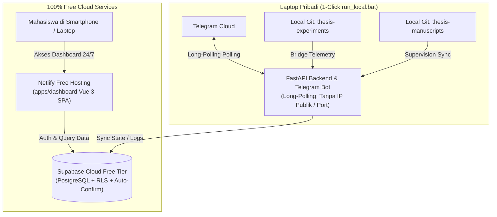

# Second Brain Agent (Student Edition 🎓)

[](LICENSE)
[](https://python.org)
[](https://fastapi.tiangolo.com)
[](https://vuejs.org)
[](https://t.me/BotFather)
[](apps/dashboard)
[](netlify.toml)

> **"Lulus Skripsi & Kuliah Sukses, Tetap Sehat, dan Me-Time Tanpa Rasa Bersalah."**

**Second Brain Agent (Student Edition)** adalah asisten kecerdasan buatan (*Autonomous AI Copilot*) hibrida yang menyatukan kenyamanan bot Telegram ambient dengan Web Dashboard interaktif modern berbasis **Mobile-First**. Dirancang khusus untuk memecahkan beban mental mahasiswa, skripsi yang macet, dan burnout akibat tugas menumpuk.

---

## 🧭 4 Pilar Kehidupan Mahasiswa

Second Brain Agent mengatur ritme hidup mahasiswa dengan prinsip prioritas deterministik teruji:

| No | Pilar | Prioritas | Fitur Unggulan Mahasiswa |
|:---:|:---|:---:|:---|
| **#1** | **🩺 Kesehatan & Vitalitas** | Paling Utama | Hidrasi 8 gelas/hari, kalkulator *Sleep Debt*, batas jam malam (*Bedtime Guardian*), & radar risiko *burnout*. |
| **#2** | **🎓 Kuliah & Akademik** | Prioritas #2 | Filter bobot SKS & urgensi tugas, *Tubes Milestone Hub* 4-tahap, dan radar kesiapan UTS/UAS. |
| **#3** | **🔬 Riset & Skripsi** | Prioritas #3 | Pelacak progres Bab 1–5, *Anti-Ghosting Dospem Radar* (>14 hari), telemetri eksperimen, & **1-klik ekspor tabel LaTeX IEEE/Overleaf**. |
| **#4** | **🎨 Hobby & Rest** | Prioritas #4 | *Guilt-free me-time* terukur (90 mnt/hari), backlog game & buku, serta *Dopamine Return Index*. |

---

## 📱 Mobile-First Experience

Dashboard web didesain dengan filosofi **True Mobile-First** agar mahasiswa dapat mengaksesnya langsung dari smartphone saat di kampus, perpustakaan, atau kosan:

- **Bottom Floating Navigation Bar (Thumb Zone):** Navigasi pilar hidup ditaruh di bawah layar layaknya aplikasi native iOS/Android, mudah dijangkau dengan jempol satu tangan.
- **Touch-Ready Interactive Knowledge Graph:** Graf simpul catatan ide dan koneksi riset dapat digeser dan ditata langsung via layar sentuh (*touch gestures*).
- **Zero-Friction Student Onboarding:** Mahasiswa dengan email kampus (`@mail.ugm.ac.id`, `@ui.ac.id`, `@itb.ac.id`, dll.) langsung terverifikasi instan via database trigger tanpa tersangkut spam filter.
- **Standar Sentuh 44px+:** Semua tombol, input, dan switch dirancang empuk dan bebas dari bug auto-zoom Safari iOS.

---

## ⚡ Arsitektur 100% Free ($0 / Bulan)

Aplikasi ini dirancang cerdas agar mahasiswa dapat menjalankannya secara **100% GRATIS seumur hidup** tanpa biaya server:


```mermaid
flowchart TD
    subgraph Cloud_Free ["100% Free Cloud Services"]
        N["Netlify Free Hosting<br/>(apps/dashboard Vue 3 SPA)"] -->|Auth & Query Data| S[("Supabase Cloud Free Tier<br/>(PostgreSQL + RLS + Auto-Confirm)")]
        User["Mahasiswa di Smartphone / Laptop"] -->|Akses Dashboard 24/7| N
    end

    subgraph Local_Device ["Laptop Pribadi (1-Click run_local.bat)"]
        B["FastAPI Backend & Telegram Bot<br/>(Long-Polling: Tanpa IP Publik / Port)"] -->|Sync State / Logs| S
        TG["Telegram Cloud"] <-->|Long-Polling Polling| B
        EXP["Local Git: thesis-experiments"] -->|Bridge Telemetry| B
        MAN["Local Git: thesis-manuscripts"] -->|Supervision Sync| B
    end
```

1. **Frontend Dashboard di Netlify (100% Free):** Hosting statis SPA yang terhubung langsung ke Supabase client-side. Live 24/7 di `https://your-app.netlify.app`.
2. **Database & Auth di Supabase (100% Free):** PostgreSQL cloud dengan enkripsi *Row Level Security* (RLS).
3. **Backend & Bot Telegram di Local Laptop (`run_local.bat`):** Menggunakan mekanisme **Long-Polling** — bot langsung aktif menjemput pesan ke server Telegram tanpa membutuhkan domain, IP publik, atau biaya server cloud.

---

## 🚀 Panduan Cepat Memulai (3 Langkah)

### Langkah 1: Buat Akun di Web Dashboard
1. Buka dashboard web Second Brain (`http://localhost:5173` atau link Netlify kamu).
2. Di tab **Daftar Baru (Sign Up)**, isi Nama Lengkap, Email Kampus/Pribadi, dan Password.
3. Klik **Buat Akun Sekarang** — akun langsung aktif dan otomatis masuk ke dashboard.

### Langkah 2: Tautkan Akun ke Bot Telegram
Kirim perintah ini ke bot Telegram Second Brain kamu:
```
/connect email@kampus.ac.id
```
*(Akun langsung tersinkronisasi detik itu juga!)*

### Langkah 3: Gunakan Kapan Saja!
- **Kirim Voice Note:** Rekam suara saat di jalan; Gemini Audio mentranskripsikannya otomatis menjadi tugas atau catatan riset.
- **Log Bimbingan:** Kirim `/bimbingan dosen minta revisi metodologi Bab 3`
- **Catat Metrik Eksperimen:** `/metric ResNet50 Akurasi: 92.4% | Epoch: 50`
- **Jaga Kesehatan:** Kirim `/minum` (+250ml) atau `/tidur 7.5`
- **Me-Time Santai:** Kirim `/chill` saat penat untuk rekomendasi recharge.

---

## 🛠️ Modul Akademik & Riset (IEEE LaTeX Ready)

Second Brain Agent memiliki jembatan telemetri khusus ke repository riset:
* [`thesis-experiments`](https://github.com/fransalwan/thesis-experiments): Melacak metrik evaluasi model (FDR, SRA, Wilcoxon).
* [`thesis-manuscripts`](https://github.com/fransalwan/thesis-manuscripts): Notulensi bimbingan bab 1–5 & peringatan dospem.

### 📄 1-Klik Ekspor Tabel LaTeX untuk Overleaf
Di tab **🔬 Riset**, cukup klik tombol **"Ekspor LaTeX"**, dan sistem otomatis menghasilkan kode tabel standar IEEE yang siap di-paste ke naskah Overleaf kamu:

```latex
% Generated by Second Brain Agent (Student Edition)
\begin{table}[htbp]
\centering
\caption{Ringkasan Eksperimen dan Evaluasi Model}
\label{tab:thesis_experiments}
\begin{tabular}{|l|c|r|}
\hline
\textbf{Model / Arsitektur} & \textbf{Parameter} & \textbf{Metrik Hasil} \\
\hline
Boosted Tree (IDCS Rate 0.15) & Runs: 5 iter & SRA: 0.7201, FDR: p<0.05 \\
ResNet-18 Benchmark & Batch: 64 & Akurasi: 88.2\% \\
\hline
\end{tabular}
\end{table}
```

---

## 💻 Menjalankan di Komputer Lokal

### 1. Clone & Setup Backend
```bash
git clone https://github.com/fransalwan/second-brain-agent.git
cd second-brain-agent/apps/backend
uv sync
cp .env.example .env
```
Isi konfigurasi di `.env` (Token Telegram, Supabase URL, Google Gemini API Key).

### 2. Jalankan Sekali Klik (Windows)
Cukup **double-click** file di root folder:
```
run_local.bat
```
FastAPI backend dan Telegram Bot polling akan langsung menyala secara bersamaan!

### 3. Jalankan Frontend Dashboard
```bash
cd apps/dashboard
npm install
npm run dev
```
Buka browser di `http://localhost:5173/login`.

---

## 🌐 Deploy Dashboard ke Netlify (2 Menit)

1. Buka [app.netlify.com](https://app.netlify.com) dan login dengan akun GitHub kamu.
2. Klik **"Add new site"** ➔ **"Import an existing project"** ➔ Pilih repo `second-brain-agent`.
3. Konfigurasi build (otomatis terbaca dari `netlify.toml`):
   - **Base directory:** `apps/dashboard`
   - **Build command:** `npm run build`
   - **Publish directory:** `dist`
4. Tambahkan Environment Variables:
   - `VITE_SUPABASE_URL` = `<url_supabase>`
   - `VITE_SUPABASE_ANON_KEY` = `<anon_key>`
5. Klik **Deploy**! Dashboard langsung live di domain Netlify gratis dengan HTTPS.

---

## 📄 Lisensi & Kontribusi

Project ini berlisensi **MIT**. Terbuka untuk kontribusi mahasiswa di seluruh Indonesia untuk bersama-sama menciptakan asisten belajar dan riset yang merdeka, gratis, dan beretika.

*Dibuat dengan ❤️ untuk mahasiswa pejuang skripsi dan IPK berkah.*