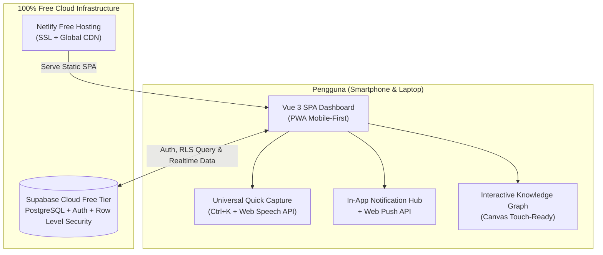

# Second Brain (Student Edition 🎓)

[](LICENSE)
[](https://vuejs.org)
[](https://vitejs.dev)
[](https://supabase.com)
[](apps/dashboard)
[](apps/dashboard)
[](apps/dashboard)
[](netlify.toml)

> **"Lulus Skripsi & Kuliah Sukses, Tetap Sehat, dan Me-Time Tanpa Rasa Bersalah."**

**Second Brain (Student Edition)** adalah platform manajemen hidup dan produktivitas mandiri (*Autonomous Life & Study Balance Hub*) berbasis web **Mobile-First** yang dirancang khusus untuk memecahkan beban mental mahasiswa: tugas menumpuk, skripsi macet, pola tidur rusak, dan *burnout*. 

Kini hadir sepenuhnya **End-to-End Standalone di Web Dashboard**, lengkap dengan **Universal Quick Capture Bar (`Ctrl + K` / Suara)**, **Pusat Notifikasi Cerdas (In-App Notification Center)**, dan **Browser Web Push Notification** tanpa memerlukan bot pihak ketiga.

🌐 **Akses Aplikasi (Gratis):**  
👉 **[https://second-brain-agent.netlify.app/](https://second-brain-agent.netlify.app/)**

---

## 🧭 4 Pilar Kehidupan Mahasiswa

Second Brain mengatur ritme hidup mahasiswa dengan prinsip prioritas deterministik teruji:

| No | Pilar | Prioritas | Fitur Unggulan Mahasiswa |
|:---:|:---|:---:|:---|
| **#1** | **🩺 Kesehatan & Vitalitas** | Paling Utama | Hidrasi 8 gelas/hari, pelacak durasi & kualitas tidur (*Sleep Debt*), jam malam (*Bedtime Guardian*), & radar risiko *burnout*. |
| **#2** | **🎓 Kuliah & Akademik** | Prioritas #2 | Bobot nilai %, sortir tenggat waktu (*deadline*), *Tubes Milestone Tracker*, *Deliverables Checklist*, dan kartu penguasaan kisi-kisi UTS/UAS (*Topic Mastery*). |
| **#3** | **🔬 Riset & Skripsi** | Prioritas #3 | Pelacak progres Bab 1–5, *Anti-Ghosting Dospem Radar* (>14 hari), telemetri eksperimen, & **1-klik ekspor tabel LaTeX IEEE/Overleaf**. |
| **#4** | **🎨 Hobby & Rest** | Prioritas #4 | *Guilt-free me-time* terukur (90 mnt/hari), backlog game & buku, serta *Dopamine Return Index*. |

---

## ⚡ Universal Quick Capture & Voice Input (`Ctrl + K` & FAB `+`)

Mencatat tugas kuliah atau ide riset kini tidak perlu lagi mengisi form panjang yang melelahkan:

* **Akses Cepat 1 Detik:**
  * **Di Laptop:** Tekan shortcut keyboard **`Ctrl + K`** (atau `Cmd + K` di Mac).
  * **Di Smartphone / HP:** Tap tombol bulat **`+`** (FAB) melayang di pojok kanan bawah layar.
* **Smart Client-Side Regex Parser:** Ketik bebas satu baris, sistem otomatis mengenali kategori & tenggat waktunya:
  * 🎓 `tugas kuis kalkulus besok mendesak` ➔ Otomatis masuk jadi **Tugas Kuliah** dengan deadline besok & badge *Urgent*.
  * 💧 `minum 300ml` (atau `minum 2 gelas`) ➔ Otomatis menambah log hidrasi **Kesehatan**.
  * 😴 `tidur 7.5 jam` ➔ Otomatis tercatat di log tidur.
  * ⏱️ `fokus: riset paper IEEE` ➔ Otomatis menyalakan timer sesi fokus deep work.
  * 💡 `ide: arsitektur state management` ➔ Otomatis jadi catatan baru & simpul baru di **Knowledge Graph**.
* **Dikte Suara (Voice to Text 🎤):** Cukup klik tombol mic dan bicara dalam Bahasa Indonesia menggunakan *Web Speech Recognition* bawaan browser (100% gratis, tanpa kuota AI server).
* **Template Cepat:** Tombol chip 1-klik untuk input instan (`+ Tugas Kuliah`, `+ Minum 250ml`, `+ Tidur 7.5 Jam`, `+ Mulai Timer`).

---

## 🔔 In-App Notification Center & Web Push Engine

Tidak perlu lagi bergantung pada aplikasi chat eksternal. Semua pengingat dan briefing penting dikelola langsung dari dalam dashboard:

* **Lonceng Notifikasi di Navbar:** Dilengkapi *Badge Counter* merah yang berdenyut aktif jika ada tugas mendesak (*urgent*).
* **Notification Drawer Interaktif:**
  * ☀️ **Morning Briefing:** Rangkuman otomatis tugas pending dan target fokus setiap pagi (05.00–12.00).
  * 🌙 **Night Wind-Down:** Peringatan ramah saat kamu masih membuka tugas melewati jam tidur malam (`23:00`).
  * 🚨 **Alert Deadline:** Peringatan tugas yang jatuh tempo hari ini atau H-2 dengan tombol aksi langsung.
  * 🧘 **Habit Reminder:** Peringatan kebiasaan aktif yang belum dicentang hari ini.
  * ⏱️ **Active Focus Session:** Indikator waktu deep work yang sedang berjalan.
* **Browser Push Notification (PWA):** Cukup klik *"Aktifkan 🔔"*, dan perangkatmu (HP & Laptop) akan memunculkan pop-up notifikasi resmi bahkan saat tab browser sedang diminimalkan.
* **Gentle Sound Chime (Web Audio API):** Efek suara sintetis lembut bawaan browser tanpa perlu aset audio eksternal.

---

## ⚡ Kontrol Interaktif End-to-End di Web

Seluruh pengelolaan dapat diselesaikan langsung dalam genggaman:

* **Daily Briefing Card Adaptif:** Menyapa ramah di beranda, menyajikan 4 metrik kilat (Pending, Selesai, Waktu Fokus, Habit), dan kartu tugas genting yang bisa diceklis langsung.
* **Centang Tugas Instan:** Tombol ceklis `[✓]` di samping setiap tugas pada daftar.
* **Timer Fokus Terintegrasi:** Masukkan nama proyek di Riwayat Fokus, tekan `▶️ Mulai`, dan akhiri dengan tombol `⏹️ Selesai Sesi Fokus` kapan saja.
* **Checklist Kebiasaan 1-Tap:** Ketuk kartu habit untuk langsung mencatat pencapaian harian dan menghitung streak berturut-turut.
* **Interactive Knowledge Graph:** Graf simpul catatan ide dan koneksi riset yang dapat digeser dan ditata langsung via layar sentuh (*touch gestures*).

---

## 💬 Curhat & Feedback Mahasiswa Terintegrasi

Dashboard dilengkapi saluran masukan langsung agar mahasiswa bisa memberikan feedback, lapor kendala, atau request fitur baru:

* **Tombol Melayang:** `💬 Curhat / Request Fitur` di pojok kiri bawah dashboard.
* **Modal Penilaian Instan:** Pilih kategori (*Request Fitur*, *Lapor Bug*, *Review*), beri rating 1–5 ⭐, dan tuliskan pesan yang langsung tersimpan di database.
* **Script Generator Google Form:** Disediakan script otomatis Google Apps Script di [`scripts/google_form_creator.js`](scripts/google_form_creator.js) untuk menghasilkan form kuesioner evaluasi 9 pertanyaan dalam 1 klik via [script.new](https://script.new).

---

## 📱 Mobile-First Design (Thumb Zone)

Dashboard web didesain dengan filosofi **True Mobile-First**:

* **Bottom Floating Navigation Bar:** Navigasi 4 pilar di bawah layar ramah jempol (*Thumb Zone*), mempermudah navigasi satu tangan di smartphone.
* **Touch Target Nyaman (44px+):** Seluruh tombol dan form dirancang empuk dan bebas dari gangguan auto-zoom pada browser smartphone.
* **Zero-Friction Student Onboarding:** Mahasiswa dapat mendaftar langsung menggunakan email kampus atau pribadi dengan verifikasi otomatis instan.

---

## 🏗️ Arsitektur 100% Free Tier ($0 / Bulan)

Aplikasi berjalan sepenuhnya tanpa biaya server cloud:


```mermaid
flowchart TD
    subgraph Client ["Pengguna (Smartphone & Laptop)"]
        UI["Vue 3 SPA Dashboard<br/>(PWA Mobile-First)"]
        QC["Universal Quick Capture<br/>(Ctrl+K + Web Speech API)"]
        NOTIF["In-App Notification Hub<br/>+ Web Push API"]
        GRAPH["Interactive Knowledge Graph<br/>(Canvas Touch-Ready)"]
    end

    subgraph Cloud ["100% Free Cloud Infrastructure"]
        NETLIFY["Netlify Free Hosting<br/>(SSL + Global CDN)"]
        SUPABASE[("Supabase Cloud Free Tier<br/>PostgreSQL + Auth + Row Level Security")]
    end

    NETLIFY -->|Serve Static SPA| UI
    UI <-->|Auth, RLS Query & Realtime Data| SUPABASE
    UI --> QC
    UI --> NOTIF
    UI --> GRAPH
```

1. **Frontend Dashboard di Netlify (100% Free):** Hosting statis SPA yang terhubung langsung ke Supabase client-side. Live 24/7 di `https://second-brain-agent.netlify.app`.
2. **Database & Auth di Supabase (100% Free):** PostgreSQL cloud dengan proteksi data ketat via *Row Level Security* (RLS).
3. **Optional Backend (FastAPI / Bot Daemon):** Tersedia di folder `apps/backend` bagi pengguna tingkat lanjut yang ingin mengaktifkan sinkronisasi bot Telegram headless di komputer lokal.

---

## 🚀 Panduan Memulai Cepat

### 1. Buka Web Dashboard
Kunjungi dashboard resmi di:
👉 **[https://second-brain-agent.netlify.app/](https://second-brain-agent.netlify.app/)**

### 2. Buat Akun Mahasiswa
1. Di tab **Daftar Baru (Sign Up)**, isi Nama Lengkap, Email Kampus/Pribadi, dan Password.
2. Klik **Buat Akun Mahasiswa Baru** — akun langsung aktif dan otomatis masuk ke dashboard.

### 3. Aktifkan Notifikasi & Quick Capture
1. Klik ikon lonceng **🔔** di kanan atas navbar ➔ klik **Aktifkan 🔔** untuk mengizinkan Web Push.
2. Tekan **`Ctrl + K`** (atau tombol **`+`** di HP) untuk langsung mencoba mencatat tugas pertamamu!

---

## 💻 Menjalankan di Komputer Lokal

Jika ingin mengembangkan dashboard secara lokal:

```bash
# 1. Clone repository
git clone https://github.com/fransalwan/second-brain-agent.git
cd second-brain-agent/apps/dashboard

# 2. Pasang dependensi
npm install

# 3. Jalankan server lokal
npm run dev
```
Buka browser di `http://localhost:5173`.

---

## 🛠️ Modul Riset (IEEE LaTeX Ready)

Di tab **🔬 Riset**, cukup klik tombol **"Ekspor LaTeX"**, dan sistem otomatis menghasilkan kode tabel standar IEEE yang siap di-paste ke naskah Overleaf kamu:

```latex
% Generated by Second Brain Agent (Student Edition)
\begin{table}[htbp]
\centering
\caption{Ringkasan Eksperimen dan Evaluasi Model}
\label{tab:thesis_experiments}
\begin{tabular}{|l|c|r|}
\hline
\textbf{Model / Arsitektur} & \textbf{Parameter} & \textbf{Metrik Hasil} \\
\hline
Boosted Tree (IDCS Rate 0.15) & Runs: 5 iter & SRA: 0.7201, FDR: p<0.05 \\
ResNet-18 Benchmark & Batch: 64 & Akurasi: 88.2\% \\
\hline
\end{tabular}
\end{table}
```

---

## 📄 Lisensi & Kontribusi

Project ini berlisensi **MIT**. Terbuka untuk kontribusi mahasiswa di seluruh Indonesia untuk bersama-sama menciptakan asisten belajar dan riset yang merdeka, gratis, dan beretika.

*Dibuat dengan ❤️ untuk mahasiswa pejuang skripsi dan IPK berkah.*